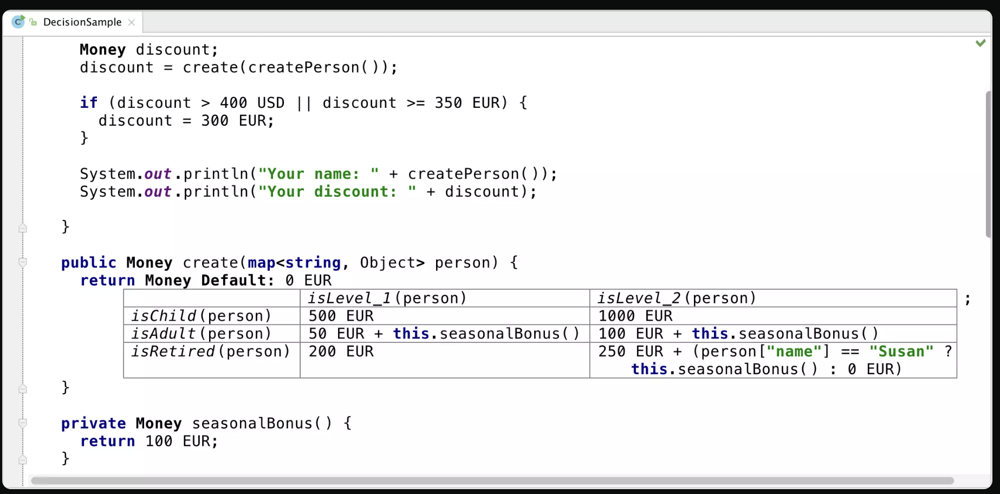
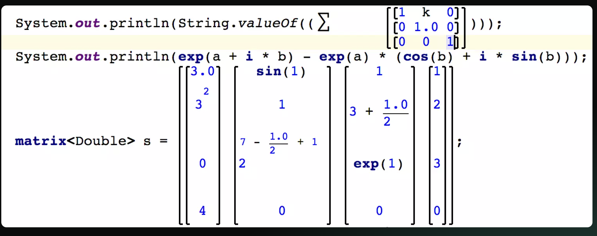
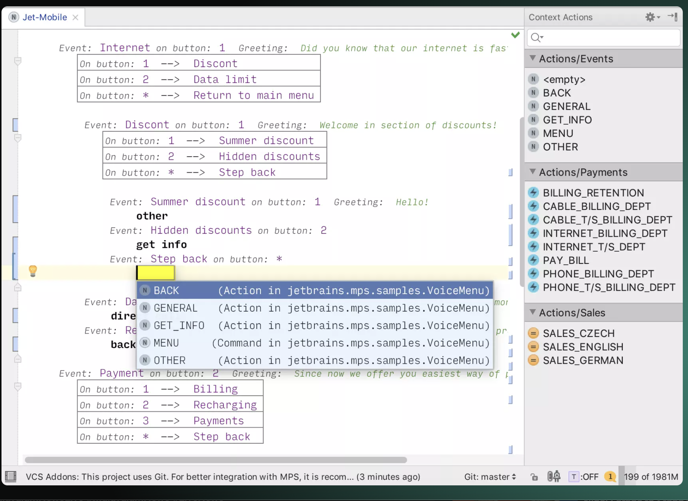
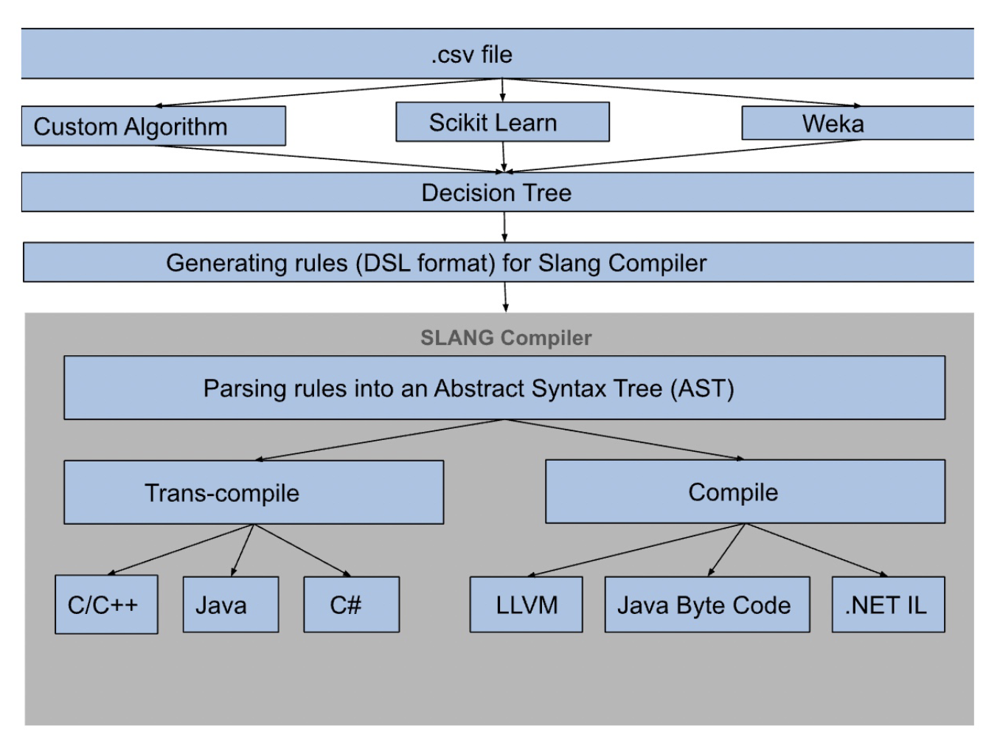

<style>
section {
    background-color: #0e0f1b
    color: #D3D3D3; /* Dimmer off-white text */
}
h1 {
    color: #e9e8eb; /* Nice blue text */
}
</style>

# DSLs an overview

###### A holistic look at domain specific languages

---

# About the session

The session is about expressive and extensible systems in general, and how DSLs in particular fit in the context of expressivity and extensibility.

---

# Core technical concerns discussed here

## Expressivity

    The ability of the system to express arbitrary domain specific computation.

## Extensibility

    The ability of the system to extend it's capability without modifying the core software.

---

# How can you create an expressive system?

By designing systems that has one or more of the following design.

- Plugin architecture
  - Host language plugins
  - Guest language plugins
- Internal DSLs
- External DSLs
- Visual DSLs

---

# How can you create an extensible system?

By designing a system with a plugin architecture and one or more of the following design.

- Plugins in host language
  - Host language
  - Internal DSLs embedded in host language
- Plugins in guest language
  - Scripting language
  - Internal DSLs
  - External DSLs
  - Visual DSLs

---

# Structural equivalence in expressiveness and extensibility

Technically the ability to capture computation dynamically in a system warrants a mechanism to execute it and such a mechanism should follow design by contract idiom, roughly something like resolve(), execute(), and cleanup() is the bare minimum abstractions required, which is nothing but an implicit plugin interface.

Given a pluggable interface the mechanism for extensibility is equivalent to the mechanism for expressivity, only the intent varies. Hence the structural equivalence.

---

# Vectors concerning design choice (I)

#### Host language plugin

- Developers are encoding the computations.
- Domain object model created in host platform is both sufficient and necessary for expressing computations.
- Skill set of the team authoring plugins are in the host language.
- Doesn't require the dynamism of a scripting language.
- Empirically proven performance advantage.

---

# Vectors concerning design choice (II)

#### Guest language plugin

- Developers are encoding the computations.
- Host platform object model is both sufficient and necessary for expressing computations.
- Skill set of the team authoring plugins are not in the host language.
- Flexibility of the guest language type system seems attractive for rapid prototyping and development.

---

# Vectors concerning design choice (III)

#### Internal DSL

- Developers are encoding the computations.
- A domain specific abstraction is necessary for capturing the intended semantics.
- Domain specific abstraction can be embedded within a general purpose language.

---

# Vectors concerning design choice (IV)

#### External DSL

- Non technical domain experts are encoding the computations.
- Embedding domain specific abstractions in a general purpose language limits the expressivity in terms of the coherence with domain ontology.
- Needs domain standardization.
- A domain specific abstraction is necessary for capturing the intended semantics.

---

# Vectors concerning design choice (V)

#### Visual DSL

- Non technical functional experts are encoding the computations.
- Technical people finds it hard to reason about the computation in a linear text based language.
- Enhanced accessibility to those who are not familiar with conventional coding practices.
- A domain specific abstraction is necessary for capturing the intended semantics.

---

# Projectional editing

---



---



---



---

# How to construct a plugin

The **Design by Contract** approach is a widely used design pattern for developing plugins.

At a code level, we define an interface that each plugin must implement. This interface serves as a 'contract' that ensures each plugin adheres to a standard structure and behavior.

```java
public interface PluginInterface {
    boolean preExecute(Context context);
    boolean execute(Context context);
    boolean postExecute(Context context);
}
```

---

# Components of a plugin

When designing a plugin with a Design by Contract approach, the following components are typically involved:

- Plugin interface.
- Plugin Invoker.
- Discovery mechanism.
- Context Object.
- Plugin implementation.

---

# Plugins demonstration

This demonstration will be a host and guest language plugin adapted from the .Net Design Patterns by Praseed Pai and Shine Xavier.

---

# An Example internal DSL for SQL - JOOQ

```java
// Fetch a SQL string from a jOOQ Query in order to manually execute it with another tool.
DSLContext create = DSL.using(conn, SQLDialect.MYSQL);
Query query = create.select(BOOK.TITLE, AUTHOR.FIRST_NAME, AUTHOR.LAST_NAME)
                    .from(BOOK)
                    .join(AUTHOR)
                    .on(BOOK.AUTHOR_ID.eq(AUTHOR.ID))
                    .where(BOOK.PUBLISHED_IN.eq(1948));

String sql = query.getSQL();
List<Object> bindValues = query.getBindValues();
```

DSLContext - the main abstraction of the library that implements the fluent interface.

---

# External DSL design (I)

External DSL follows a proper programming language design.
It requires all the infrastructure a general purpose language requires.

Standard compiler pipeline will consist of the following

- Lexer
- Parser
- Semantic Check
- Optimizer
- Transcompiler or Compiler (Depends on the target)

---

# External DSL design (II)

Runtime

- Standard library consisting of domain object models & abstractions on top of it.

Other infrastructure required

- Language Server
- Editor

---

# An example use case

---



---

# Using ANTLR for language design

```antlr
prog:   stat+ ;
stat:   expr ';'                   # ExprStat
    |   'if' '(' expr ')' prog ('else' prog)?  # IfElseStat
    |   'print' '(' expr ')' ';'   # PrintStat
    |   ID '=' expr ';'            # AssignStat
    ;

expr:   expr andOp expr            # And
    |   expr orOp expr             # Or
    |   expr relationalOp expr     # Relational
    |   expr mulDivOp expr         # MulDiv
    |   expr addSubOp expr         # AddSub
    |   '(' expr ')'               # Parens
    |   INT                        # Int
    |   ID                         # Var
    |   '!' expr                   # Not
    ;
```

---

# An example visual DSL


---

# Semantic constructs in a Visual DSL

- Relational expression
- Logical expression
- Module invocation
- If expression (projected construct)
- Loop expression (projected construct)
- ...

---

# Logical and Relational Expressions

```JSON
{
    "id": "outcome",
    "outcome": "Reject",
    "isDefault": false,
    "rules": [
        {
        "rules": [
            {
            "rules": [
                {
                    "field": "firstName",
                    "value": ["Go", "Kevin"],
                    "operator": "isAnyOf"
                },
                {
                    "field": "lastName",
                    "value": "Team",
                    "operator": "is"
                }
            ],
            "combinator": "and"
            },
            {
                "field": "email",
                "value": "goteam@gbgplc.com",
                "operator": "is"
            }
        ],
        "combinator": "xor"
        }
    ]
}
```

---

# Module invocation

```JSON
{
    "id": "node2",
    "type": "module",
    "variantId": "default",
    "data": {
        "grId": "grn:::gbg:design:module:module1@latest",
        "id": "module1",
        "name": "ID3 UK 1 + 1 module",
        "data": {
            "base64File": "@@binary", // Flowable App honoring module spec
            "symbols": [] // variables or state exposed by the module
        }
    }
}
```

---

# If expression

```JSON
{
    "id": "node3",
    "type": "if",
    "expression":  {
        "left": {
            "type": "constantExpression",
            "value": "10"
        },
        "right": {
            "type": "constantExpression",
            "value": "20"
        },
        "operator": "<",
        "leftTargetNode": "node8",
        "rightTargetNode": "node4",
    }
}
```

---

# Loop expression

```JSON
{
    "id": "node4",
    "type": "loop",
    "expression":  {
        "left": {
            "type": "constantExpression",
            "value": "10"
        },
        "right": {
            "type": "constantExpression",
            "value": "20"
        },
        "operator": "<",
        "exitNode": "node6",
        "repeatNode": "node2",
    }
}
```

---

# Thank You

You can find more details in our [GitHub repository](https://github.com/gbgplc-internal/identity-gbggo-dev-playground).

- [Presentation](https://github.com/gbgplc-internal/identity-gbggo-dev-playground/blob/main/presentations/DSLsAnOverview/dsls-an-overview-jun-8.pdf)
- [Presentation Markdown](https://github.com/gbgplc-internal/identity-gbggo-dev-playground/blob/main/presentations/DSLsAnOverview/dsls-an-overview-jun-8.md)
- [Plugin Example, Internal DSL, Compilers - Pull Sub Modules](https://github.com/gbgplc-internal/identity-gbggo-dev-playground/tree/main/external-projects)
- [Antlr Example](https://github.com/gbgplc-internal/identity-gbggo-dev-playground/tree/main/antlr-general-purpose)

<!-- Q&A >
